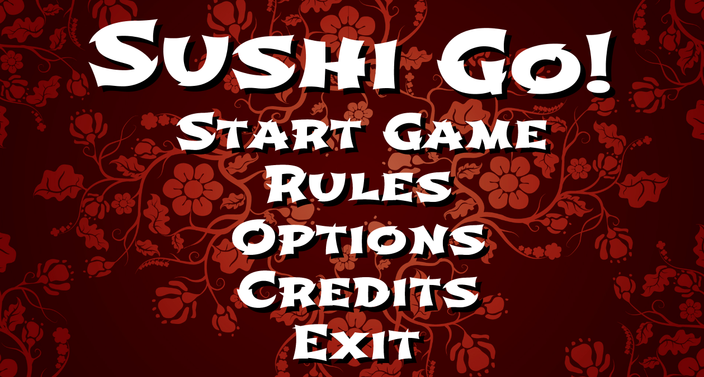
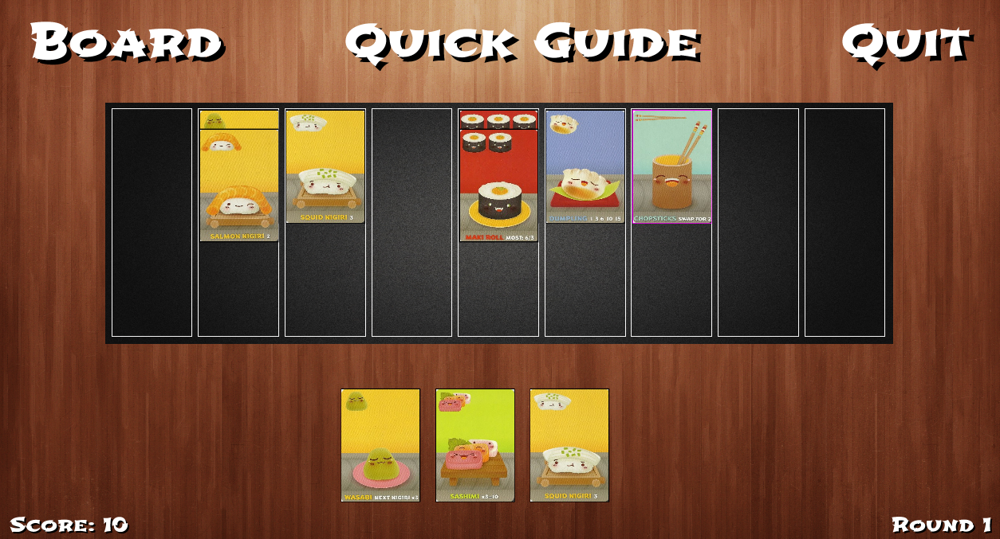
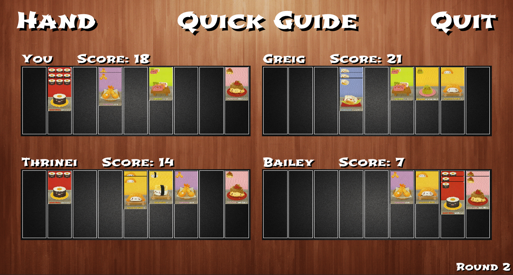
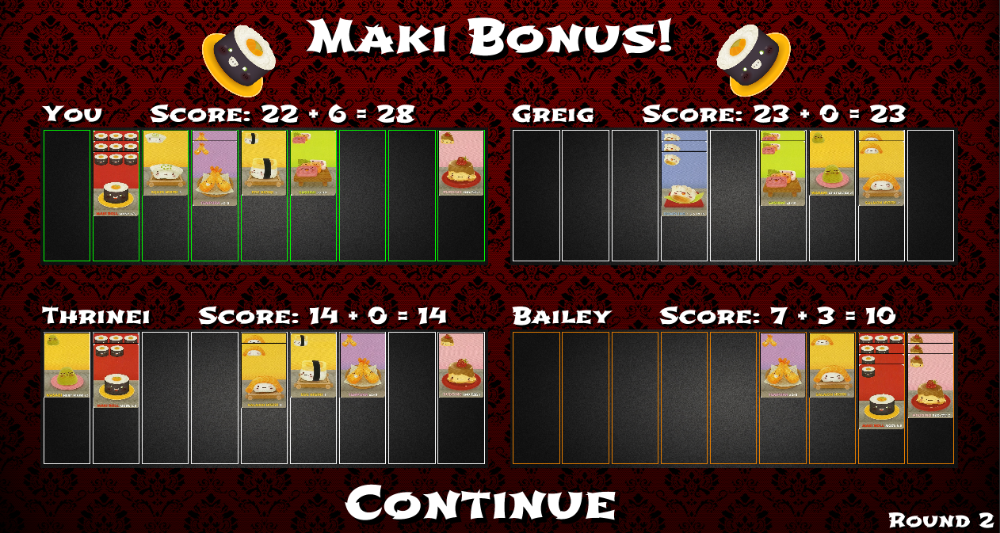
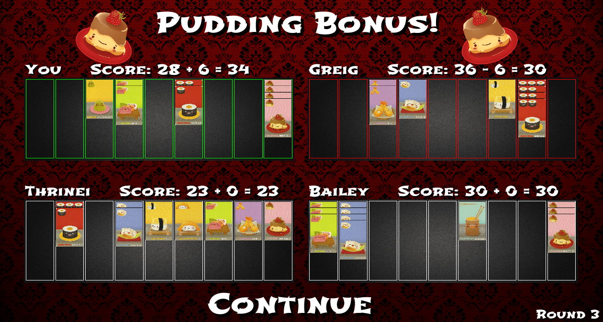

# Sushi Go!
Hello! This was a group project for my software engineering class in which we created the Sushi Go! card game by 
GameWright. The goal of the project was to get experience using version control, UML diagrams, rapid prototyping, and
the agile methodology. Testing using JUnit 4 was also used to ensure that the application worked as intended. Thanks for
reading!
## Summary of Rules
Sushi Go! is a 2-5 player game in which each player is dealt a hand of sushi's. Each player simultaneously chooses and
plays a sushi. The player gets points based on what they play. Afterwards, their hand of cards is passed to the next 
player in a clockwise fashion. This repeats until no cards remain. Afterwards, a round summary consisting of what every
player played along with what they scored is displayed. The game consists of three rounds and the player with the most
points after the third round wins the game. A more in depth guide can be found in game or here:
https://www.fgbradleys.com/rules/rules2/SushiGo-rules.pdf
## User Interface
Here is what you can expect when running the application. Note: By default, the application will launch in full screen.
You can change the screen to windowed mode by navigating to *Options*.
### Title Screen

### Player's Hand
Here is the screen displaying the player's hand. In order to play a card, drag and drop the card onto the black mat.
Afterwards, your leftover cards will fly off to the left side of the screen and cards coming from your opponent will
come from the right side of the screen.

### Board
If you clicked on the *Board* option in the top left corner of the player's hand screen, you will be taken to the board
screen. This displays what each player has played as well as their scores.

### Maki Bonus
After a round is over, you will be taken to this screen. After each round, player's with the most and second most amount
of Maki Rolls get a bonus.

### Pudding Bonus
Similar to the Maki Bonus that you get at the end of each round. At the end of the game, the player with the most
Puddings gets a bonus while the player with the least gets penalized.

### Game Over Screen
